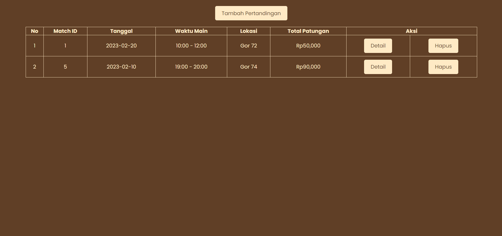
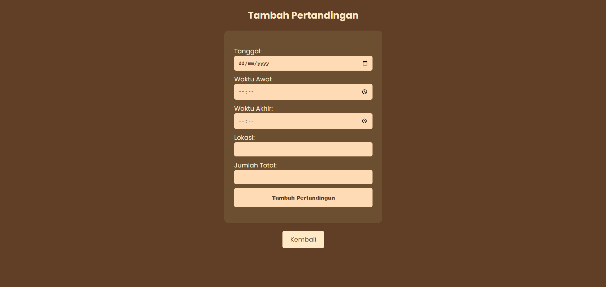
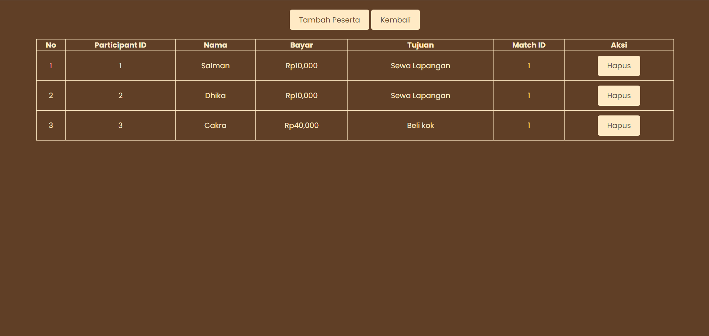
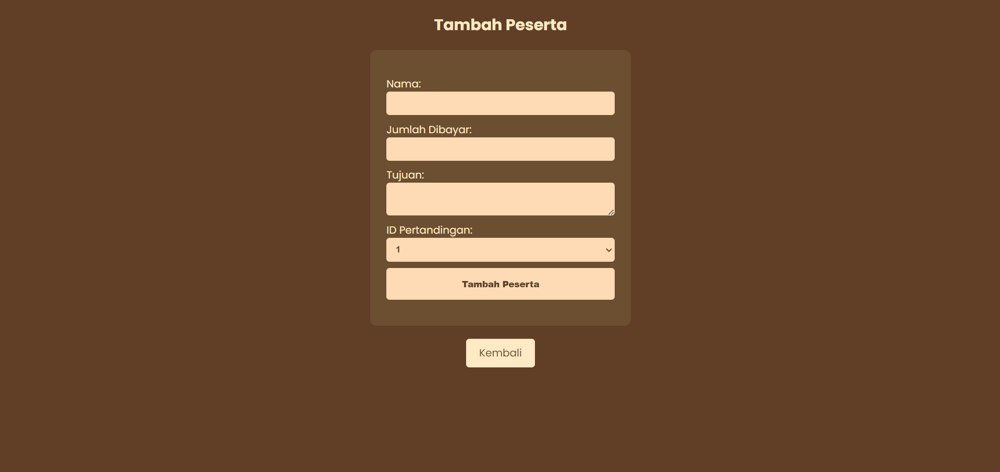

# SISTEM PATUNGAN BADMINTON

Sistem Patungan Badminton adalah aplikasi web yang dirancang untuk membantu pengguna dalam mengelola pertandingan badminton dan peserta yang terlibat. Aplikasi ini memungkinkan pengguna untuk menambahkan, mengedit, dan menghapus pertandingan serta peserta, dengan antarmuka yang sederhana dan intuitif.

## Fitur
- **Lihat Pertandingan**: Menampilkan daftar pertandingan yang telah ditambahkan, termasuk informasi seperti tanggal, waktu, lokasi, dan total patungan.
- **Tambah Pertandingan**: Pengguna dapat menambahkan pertandingan baru dengan mengisi informasi yang diperlukan seperti tanggal, waktu, lokasi, dan jumlah total.
- **Tambah Peserta**: Memungkinkan pengguna untuk menambahkan peserta ke pertandingan yang sudah ada, termasuk informasi nama, jumlah yang dibayar, dan tujuan.
- **Hapus Pertandingan dan Peserta**: Pengguna dapat menghapus pertandingan dan peserta terkait dengan konfirmasi terlebih dahulu.
- **Detail Peserta**: Menampilkan informasi lengkap tentang peserta yang terdaftar dalam pertandingan tertentu.

## Teknologi Yang Digunakan
- **HTML**: Untuk struktur halaman web.
- **CSS**: Untuk styling dan tata letak.
- **PHP**: Untuk pengolahan data di sisi server.
- **MySQL**: Untuk penyimpanan data pertandingan dan peserta.

## Penggunaan
1. **Menambahkan Pertandingan**: Akses halaman `add_matches.php`, isi formulir dengan informasi pertandingan, dan kirimkan.
2. **Melihat Pertandingan**: Akses halaman utama `index.php` untuk melihat daftar pertandingan yang ada.
3. **Menambahkan Peserta**: Akses halaman `add_participants.php`, pilih pertandingan, dan isi formulir untuk menambahkan peserta.
4. **Menghapus Pertandingan/Peserta**: Klik tautan hapus pada daftar pertandingan atau peserta dan konfirmasi penghapusan.

> **JIKA ADA KESALAHAN, BUG, DAN FITUR BARU BERIKAN KOMENTAR KALIAN DI ``` ISSUES ``` TAB**

---




